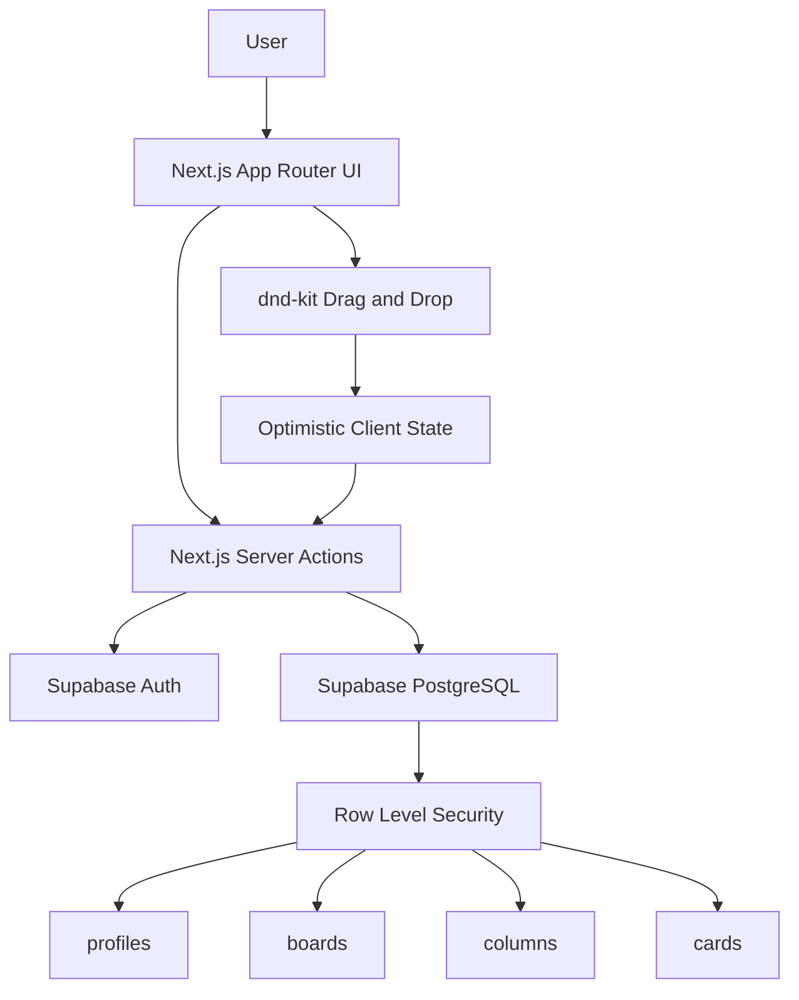

# TaskFlow Kanban

TaskFlow is a responsive Kanban project management board built with Next.js, Supabase, and dnd-kit.

The project focuses on the core Kanban experience: authenticated users can create boards, manage cards, move tasks between columns, and preserve the exact card order after refreshing the page.

Live Demo: https://taskflow-kanban-ardapalas.vercel.app  
Repository: https://github.com/ardapalas/TaskflowKanban

---

## Features

- User registration and login with Supabase Auth
- Email confirmation callback flow
- Protected dashboard route
- Board creation and deletion
- Default columns for every new board:
  - To Do
  - In Progress
  - Done
- Card creation, inline editing, and deletion
- Drag-and-drop cards within the same column
- Drag-and-drop cards across columns
- Persistent card ordering after page refresh
- Visual drag feedback:
  - dragged card animation
  - highlighted source/target areas
  - color feedback while moving cards
- Mobile-friendly interface
- Mobile fallback move button:
  - users can tap a move button
  - select the target column
  - move a card even if drag-and-drop is inconvenient on a touch device
- Activity history for card movements:
  - move time
  - source column
  - target column
- Responsive UI for desktop and mobile
- Supabase Row Level Security policies
- Vercel deployment

---

## Tech Stack

| Area | Technology |
|---|---|
| Framework | Next.js 16 App Router |
| Language | TypeScript |
| Styling | Tailwind CSS v4 |
| UI Components | shadcn/ui + Radix primitives |
| Drag and Drop | dnd-kit |
| Auth | Supabase Auth |
| Database | Supabase PostgreSQL |
| Security | Supabase RLS |
| Deployment | Vercel |

---

## Project Structure

```txt
app/
├── auth/
│   └── callback/
│       └── route.ts
├── board/
│   └── [id]/
│       ├── actions.ts
│       ├── BoardClient.tsx
│       └── page.tsx
├── dashboard/
│   ├── actions.ts
│   └── page.tsx
├── login/
│   ├── actions.ts
│   └── page.tsx
├── register/
│   └── page.tsx
├── globals.css
├── layout.tsx
└── page.tsx

components/
└── ui/

lib/
├── supabase/
│   ├── client.ts
│   └── server.ts
└── utils.ts
```

---

## Database Model

TaskFlow uses a relational model:

```txt
profiles
  └── boards
        └── columns
              └── cards
```

### Core Tables

```sql
profiles (
  id uuid primary key references auth.users(id) on delete cascade,
  email text not null,
  created_at timestamptz
);

boards (
  id uuid primary key default gen_random_uuid(),
  user_id uuid references profiles(id) on delete cascade,
  title text,
  created_at timestamptz,
  updated_at timestamptz
);

columns (
  id uuid primary key default gen_random_uuid(),
  board_id uuid references boards(id) on delete cascade,
  title text,
  position int,
  created_at timestamptz
);

cards (
  id uuid primary key default gen_random_uuid(),
  column_id uuid references columns(id) on delete cascade,
  title text,
  description text,
  position int,
  created_at timestamptz,
  updated_at timestamptz
);
```

The important fields for ordering are:

```txt
columns.position
cards.position
cards.column_id
```

When a card is moved to another column, both the card's `column_id` and the affected `position` values are updated.

---

## Activity History Model

TaskFlow includes activity history for card movements.

The current activity history focuses on the most important Kanban audit information:

- when the card was moved
- from which column it was moved
- to which column it was moved

This keeps the activity log focused and useful without expanding the 48-hour scope too much.

A simplified activity history model can look like this:

```sql
activity_logs (
  id uuid primary key default gen_random_uuid(),
  board_id uuid references boards(id) on delete cascade,
  card_id uuid references cards(id) on delete cascade,
  from_column_id uuid references columns(id),
  to_column_id uuid references columns(id),
  created_at timestamptz default now()
);
```

This is enough to answer questions like:

```txt
Card moved from "To Do" to "In Progress" at 14:32.
```

For a larger team-based version, this table could later be expanded with `user_id`, action types, and detailed metadata.

---

## Security Model

The application uses Supabase Row Level Security.

Each user can only access their own boards.

Column and card access is checked through the ownership chain:

```txt
cards → columns → boards → user_id
```

This means a user cannot read, create, update, or delete another user's board data even if they know the UUID.

Example policy idea:

```sql
EXISTS (
  SELECT 1
  FROM columns
  JOIN boards ON boards.id = columns.board_id
  WHERE columns.id = cards.column_id
  AND boards.user_id = auth.uid()
)
```

This approach keeps the data model secure while still allowing nested resources like columns and cards.

---

## Drag-and-Drop Library Decision

The project uses **dnd-kit**.

I compared four options:

| Option | Pros | Cons |
|---|---|---|
| dnd-kit | Modern, actively maintained, flexible, touch-friendly, good React integration | Requires more manual state/collision logic |
| @hello-pangea/dnd | Easy Kanban/list API, familiar react-beautiful-dnd style | Based on an older API model, less flexible for custom interactions |
| SortableJS | Mature, fast, framework-agnostic | DOM-oriented approach feels less natural with React state and Server Actions |
| Native HTML5 Drag and Drop | No extra dependency, small bundle impact | Weak mobile/touch support, inconsistent browser behavior, harder custom UX |

I chose **dnd-kit** because this project explicitly needed a modern, mobile-friendly drag-and-drop experience.

Native browser drag-and-drop has weak touch support and inconsistent browser behavior.  
`react-beautiful-dnd` is no longer the safest long-term choice because its maintenance status is limited.  
`@hello-pangea/dnd` is a good fork, but it still follows the older react-beautiful-dnd API style.  
`SortableJS` is powerful, but its DOM-oriented approach is less natural for this React + Server Actions architecture.

dnd-kit provided the best balance of:

- mobile support
- active ecosystem
- flexible sensors
- custom drag handles
- collision detection
- modern React compatibility

---

## Drag-and-Drop UX

The app gives visual feedback during drag-and-drop.

Examples:

- the dragged card visually changes while moving
- source and target areas are highlighted
- the target column gives clear feedback
- the moved-from and moved-to areas use visual color cues
- cards animate into their new position

These details make the interaction easier to understand, especially when moving cards across columns.

The database is not updated continuously while dragging.  
Instead, the UI updates locally during interaction and the final order is saved when the drag action ends.

---

## Ordering Strategy

Card order must survive page refreshes, so ordering is stored in the database.

Each card has:

```txt
column_id
position
```

When a card is moved:

1. The card's source column is detected.
2. The target column is detected.
3. The card is inserted into the new position in local state.
4. The affected cards are re-indexed.
5. The new `column_id` and `position` values are saved to Supabase.
6. On refresh, cards are queried with `order('position')`.

For this 48-hour project, I used integer-based ordering:

```txt
0, 1, 2, 3, ...
```

This is simple, reliable, and easy to reason about for small and medium boards.

For larger boards, a more scalable future approach would be fractional ordering:

```txt
10, 20, 30
```

If a card is inserted between 10 and 20, it can receive position 15.  
That would reduce how often the whole column needs to be re-indexed.

---

## Mobile Drag-and-Drop

The app is responsive and usable on mobile devices.

On smaller screens, columns are stacked vertically instead of being forced into a narrow horizontal layout.

Mobile-specific choices:

- dnd-kit touch support
- touch-friendly drag handle
- larger tap targets
- responsive column layout
- mobile-specific move button
- fallback movement flow for touch devices

The app includes a dedicated mobile move mechanism.  
If drag-and-drop is inconvenient on a phone, the user can tap the move button and select the target column manually.

This is useful because mobile drag-and-drop can be affected by:

- browser scrolling behavior
- touch delay
- small screen size
- accidental taps
- device-specific differences

The goal was not to build a native mobile app, but to make the web interface reliable and usable on mobile browsers.

---

## Should Columns Be Reorderable?

The database already includes:

```txt
columns.position
```

So the data model supports column ordering.

In this version, I prioritized card drag-and-drop because it is the core Kanban behavior.

Column reordering is a good next iteration and can be implemented with another `SortableContext` around the columns.

This was intentionally deferred because the 48-hour scope was better spent on:

- reliable card drag-and-drop
- cross-column movement
- persistent ordering
- mobile usability
- RLS security
- deployment stability

---

## Labels, Due Dates, and Assignees

These are useful features, but I treated them as future improvements.

Priority evaluation:

| Feature | Value | 48-hour priority |
|---|---|---|
| Due dates | High | Good future addition |
| Labels | Medium | Useful but adds UI complexity |
| Assignees | Medium/Low | More valuable after board sharing exists |

For this project, I prioritized:

```txt
core Kanban flow > feature breadth
```

That means drag-and-drop, persistence, mobile usability, authentication, and data security were more important than adding many partially finished features.

---

## Future Improvement: Board Sharing

Board sharing is not implemented in the current version.

The current version uses single-user board ownership:

```txt
boards.user_id = auth.uid()
```

This keeps the MVP secure and simple: each authenticated user can only access their own boards through Supabase RLS policies.

A future sharing model could use a `board_members` table:

```sql
board_members (
  board_id uuid,
  user_id uuid,
  role text -- viewer or editor
);
```

Possible roles:

- `viewer`: can only read the board
- `editor`: can create, update, move, and delete cards
- `owner`: can manage members and delete the board

RLS policies would then check both ownership and membership.

This would allow two possible collaboration modes:

1. View-only sharing
2. Collaborative editing

For a production version, I would implement view-only sharing first because it is safer and simpler. Collaborative editing would require more careful conflict handling, realtime updates, and activity tracking.

---

## Performance Considerations

The app updates the database on drag end, not continuously while dragging.

This avoids unnecessary database writes and keeps the drag interaction smoother.

Current approach:

```txt
Drag starts → local UI updates
Drag ends → final position is saved
Refresh → order is loaded from database
```

For boards with many cards, future improvements could include:

- fractional ranking to reduce position updates
- memoized column/card components
- virtualization for very large columns
- batched database updates
- optimistic UI rollback on failed updates

For a 48-hour technical project, the current solution is intentionally simple and reliable.

---

## 48-Hour Scope Decisions

The main goal was to build a complete and reliable Kanban MVP rather than many unfinished features.

Completed core scope:

- Authentication
- Board creation and deletion
- Default Kanban columns
- Card creation
- Card editing
- Card deletion
- Same-column drag-and-drop
- Cross-column drag-and-drop
- Visual drag feedback
- Mobile move fallback
- Persistent ordering
- Basic movement activity history
- Mobile usability
- Supabase RLS security
- Vercel deployment

Deferred future scope:

- Column reorder UI
- Board sharing
- Labels
- Due dates
- Assignees
- Advanced filtering/search
- Realtime collaboration
- More detailed activity logs

The main trade-off was intentional: I focused on making the core Kanban interaction solid instead of adding many secondary features with incomplete behavior.

---

## Architecture Overview



---

## Local Setup

Clone the repository:

```bash
git clone https://github.com/ardapalas/TaskflowKanban.git
cd TaskflowKanban
```

Install dependencies:

```bash
npm install
```

Create `.env.local`:

```env
NEXT_PUBLIC_SUPABASE_URL=your_supabase_project_url
NEXT_PUBLIC_SUPABASE_ANON_KEY=your_supabase_anon_key
NEXT_PUBLIC_SITE_URL=http://localhost:3000
```

Run the development server:

```bash
npm run dev
```

Open:

```txt
http://localhost:3000
```

---

## Build and Lint

```bash
npm run lint
npm run build
```

The project is expected to pass both before deployment.

---

## Deployment

The app is deployed on Vercel.

Deployment flow:

```txt
GitHub push → Vercel build → Production deployment
```

Supabase environment variables must be configured in Vercel Project Settings.

Required environment variables:

```env
NEXT_PUBLIC_SUPABASE_URL
NEXT_PUBLIC_SUPABASE_ANON_KEY
NEXT_PUBLIC_SITE_URL
```

---

## Demo Flow

A reviewer can test the app with this flow:

1. Open the live demo.
2. Register or log in.
3. Create a new board.
4. Confirm that default columns are created.
5. Add cards.
6. Edit a card.
7. Delete a card.
8. Move a card within the same column.
9. Move a card to another column.
10. Refresh the page and confirm the order is preserved.
11. Check the movement activity history.
12. Test the same flow on mobile.
13. On mobile, try both drag-and-drop and the move button.

---

## Future Improvements

- Column reordering
- Board sharing with viewer/editor roles
- Due dates
- Labels
- Assignees
- Search and filtering
- Realtime collaboration with Supabase Realtime
- Fractional ordering for large boards
- More detailed activity history
- Keyboard-accessible drag-and-drop polish

---

## Author

Arda Palas  
Mathematics and Computer Science  
Istanbul Kultur University
